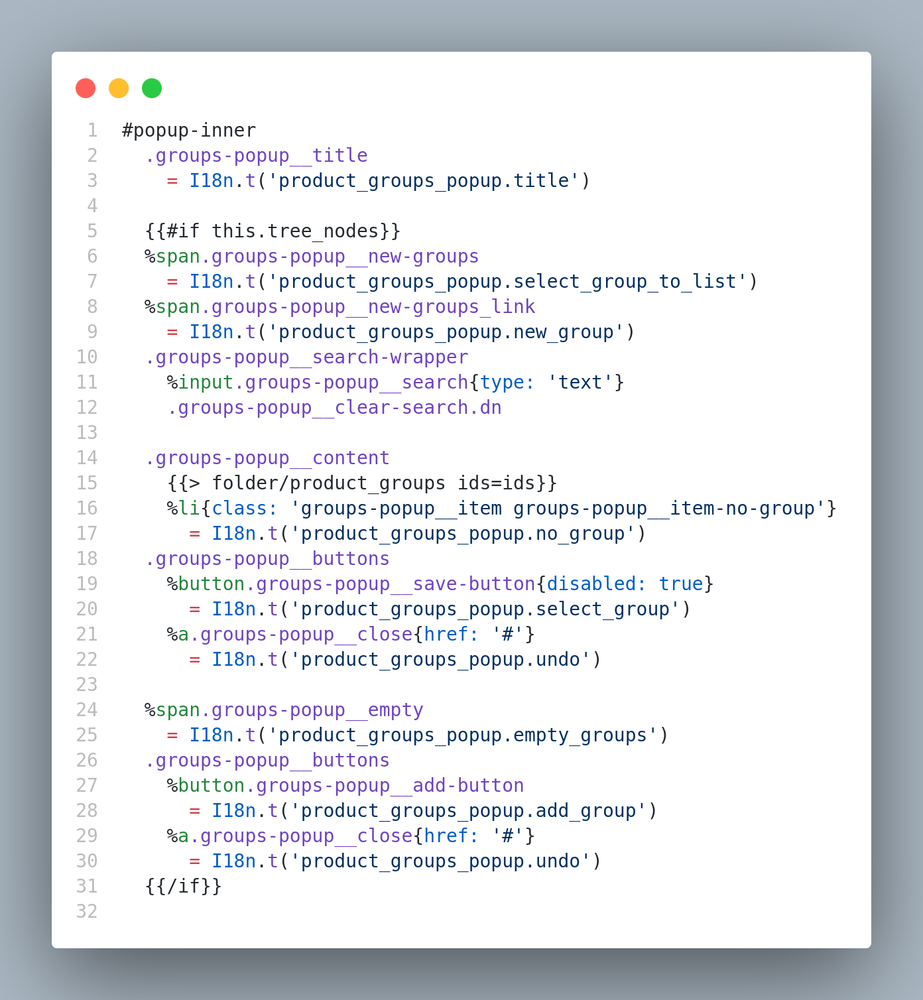

# Hamlbars Highlighter

  

 
Add syntax highlighting and snippets for Hamlbars templates.

## Features

* Syntax highlighting for Hamlbars.
* Snippets for if, else, if else, unless, each, with operators.

## Usage Instructions

To use the snippets, simply start typing the conditional operators.

## Credits

Based on https://github.com/karuna/haml-vscode (haml.json)

**Enjoy!**
